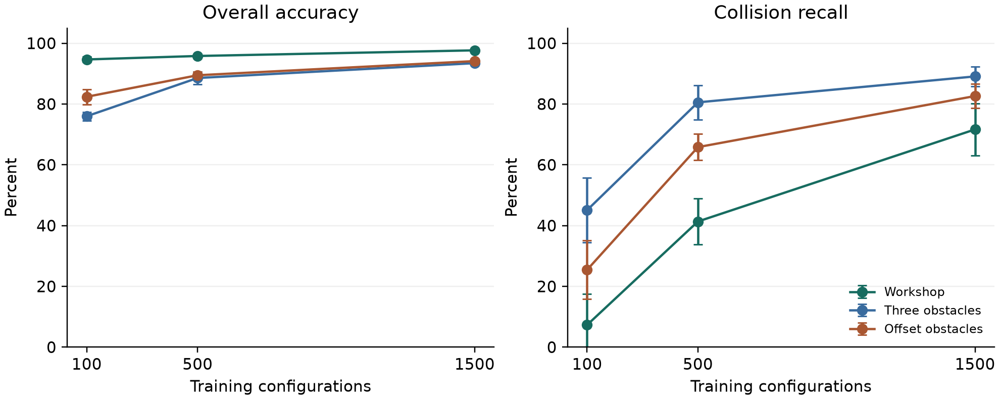
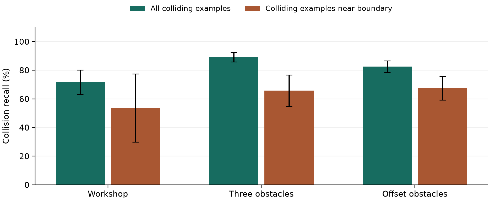

# When high accuracy misses collisions: a reproducible study of a small robot-arm classifier

**ReachLab engineering research report - revised draft**  
October 8, 2026. AI-assisted; author review pending. Not peer reviewed.

## Abstract

A collision classifier can look accurate because collisions are rare. This study examines that problem in ReachLab, a browser workbench for a two-link robot arm. A five-nearest-neighbor classifier was trained on 100, 500, or 1,500 geometrically labeled joint configurations. Each training size was evaluated in three obstacle layouts using five paired training and test seeds, for 45 model evaluations and 15,000 generated test configurations across scene-seed pairs. With 100 training examples, the sparse Workshop layout produced mean accuracy of 94.66% but collision recall of only 7.31%; a classifier that always predicted free scored 95.14% accuracy. With 1,500 examples, mean recall rose to 71.63% in Workshop, 89.08% in the Three obstacles layout, and 82.62% in the Offset obstacles layout. Recall near the modeled collision boundary remained lower. These results show why overall accuracy is a poor standalone measure for this task. ReachLab uses the learned model to make errors visible, while a separate geometric rule checks planned motion. The experiment concerns synthetic geometry and does not measure physical safety or student learning.

## 1. Research question

The central question is simple: when a small learned model predicts whether a robot arm will collide, what does its accuracy leave out?

For a learner watching an arm move, the difference between a free configuration and a collision is concrete. A classifier replaces that geometric calculation with a prediction from examples. This makes the arm a useful setting for examining how training size, class imbalance, and distance from a decision boundary affect errors. ReachLab presents the geometry and the prediction side by side so those differences can be inspected rather than hidden behind a single score.

The present study asks two descriptive questions. First, how do accuracy and collision recall change across three training sizes and three obstacle layouts? Second, how does recall near a collision boundary compare with recall over uniformly sampled joint configurations? The analysis was developed after an initial single-scene benchmark; it was not preregistered. No model selection or significance test is claimed.

ReachLab also has an access goal: learners should be able to explore robot geometry without buying a robot or paying for a model API. That goal motivated local computation and offline revisits. It has not been tested in a classroom. A compatible device and an initial copy of the application are still required.

## 2. Relation to existing work

Virtual robotics is an established educational approach. VEXcode VR offers browser-based robot programming [1], and Cyberbotics introduced Robotbenchmark as a set of online robotics challenges [2]. ReachLab does not claim to be the first virtual robot or to replace these systems. Its focus is a small, inspectable exercise connecting arm geometry, configuration-space planning, and an imperfect collision classifier.

The kinematics and grid-planning methods follow standard robotics ideas described by Lynch and Park [3-5]. Nearest-neighbor classification and evaluation on held-out examples are also established methods [6,7]. The contribution here is the implemented workbench, the reproducible comparison, and the particular failure pattern it exposes. The algorithms themselves are not new.

## 3. Geometry and reference labels

The arm has link lengths L1 = 130 and L2 = 100, a base at (0,0), and a link radius of 5. The interface calls distances millimeters to give the diagram a familiar scale, but they are simulated units, not measurements from a calibrated robot. Joint angles are in radians. The second angle is relative to the first link.

For joint configuration q = (q1,q2), the elbow and tip are

 e = (L1 cos(q1), L1 sin(q1)),

 p = (L1 cos(q1) + L2 cos(q1 + q2), L1 sin(q1) + L2 sin(q1 + q2)).

Each link is a capsule: a line segment thickened by the link radius. For a circular obstacle, the label is collision when the shortest center-to-segment distance is no larger than the obstacle radius plus the link radius, with a comparison tolerance of 10^-9. The point-to-segment calculation clamps an orthogonal projection to the segment, so endpoint contact is included. Both links are checked.

The geometric rule supplies the labels for training and testing. Agreement with those labels therefore measures how well the classifier approximates this implemented rule. It does not independently establish that the geometry represents a manufactured arm correctly. Self-collision, a base housing, three-dimensional motion, torque, compliance, sensing error, and dynamics are outside the model.

Three fixed layouts were selected to give different collision prevalence and boundary shapes:

| Layout | Circular obstacles: (x, y, radius) |
|---|---|
| Workshop | (180, 0, 12); (-150, -60, 18) |
| Three obstacles | (145, 35, 22); (65, -110, 24); (-105, 75, 18) |
| Offset obstacles | (110, 110, 25); (-120, 90, 20); (70, -140, 15) |

Workshop is the application's default layout. Three obstacles reproduces the original benchmark scene. Offset obstacles is an additional comparison, not a randomly drawn sample of all possible environments.

## 4. Experimental design

### Sampling and paired comparisons

For each layout, five runs used training seeds 314159, 271828, 161803, 57721, and 141421, paired respectively with test seeds 90210, 73519, 86420, 24680, and 13579. Each test set contained 1,000 configurations. Both joint angles were drawn uniformly from [-pi,pi) using the implementation's seeded linear congruential generator: state is updated by 1664525 times state plus 1013904223, modulo 2^32.

Within each run, the 100- and 500-example training sets are prefixes of the 1,500-example set, and all three models use the same test set. This gives paired comparisons of training size. The same angle streams are also used across layouts; their geometry labels differ. Consequently, the 15,000 scene-seed test entries include repeated angle coordinates across scenes, and the 45 evaluations must not be treated as independent datasets. Different training and test seeds separate the generation streams, without proving mathematical independence of the pseudorandom draws.

There was no tuning of k, sampling distribution, or features against these test results. The experiment fixes k = 5, uses uniform sampling, and evaluates all specified models. Results summarize these selected layouts and seed runs rather than a wider population of robots.

### Classifier

Neighbors are ranked by

 D(q,s) = 2 - 2 cos(q1 - s1) + 2 - 2 cos(q2 - s2).

This is squared chord distance in the feature representation (cos(q1), sin(q1), cos(q2), sin(q2)). It treats angles on opposite sides of the branch cut as nearby. Five neighbors vote with equal weight, and a majority collision vote produces a collision prediction. Ties in distance are resolved by sample index. The vote fraction displayed by the software is not a calibrated probability.

### Metrics and baseline

Collision is the positive class. Accuracy is (TP + TN)/N, collision recall is TP/(TP + FN), and the missed-collision rate is FN/(TP + FN). A false negative is a colliding configuration predicted free. A constant-free baseline predicts free for every test configuration. Its accuracy equals the free-class prevalence, while its collision recall is zero.

Means and sample standard deviations are calculated across the five seed runs separately for each layout and training size. Standard deviations describe observed variation between those runs; they are not confidence intervals. Small positive-class counts make recall especially variable in Workshop.

### Boundary analysis

Signed clearance is the minimum center-to-segment distance over both links and all obstacles, minus the obstacle radius and link radius. Negative clearance means penetration under the geometric model. A test configuration belongs to the boundary band when the absolute clearance is at most 5 simulation units. Boundary recall is computed using the colliding examples within that band. It is a subset analysis of the same test configurations, not a separately balanced or independently sampled test set. Five units is an analyst-selected threshold, not a physical safety margin.

## 5. Results

Table 1 reports mean percentages plus or minus the sample standard deviation, in percentage points, across five runs. Each run uses 1,000 test configurations. Boundary recall uses only the colliding configurations inside the clearance band.

| Layout | Training n | Accuracy (%) | Collision recall (%) | Boundary recall (%) |
|---|---:|---:|---:|---:|
| Workshop | 100 | 94.66 +/- 0.89 | 7.31 +/- 10.21 | 4.29 +/- 9.58 |
| Workshop | 500 | 95.80 +/- 0.49 | 41.35 +/- 7.51 | 28.24 +/- 9.61 |
| Workshop | 1,500 | 97.66 +/- 0.43 | 71.63 +/- 8.55 | 53.66 +/- 23.83 |
| Three obstacles | 100 | 75.98 +/- 1.43 | 45.08 +/- 10.62 | 35.87 +/- 7.96 |
| Three obstacles | 500 | 88.56 +/- 2.08 | 80.54 +/- 5.64 | 59.83 +/- 14.92 |
| Three obstacles | 1,500 | 93.44 +/- 0.61 | 89.08 +/- 3.27 | 65.72 +/- 11.08 |
| Offset obstacles | 100 | 82.38 +/- 2.50 | 25.44 +/- 9.67 | 15.27 +/- 8.94 |
| Offset obstacles | 500 | 89.46 +/- 1.11 | 65.81 +/- 4.35 | 47.79 +/- 9.42 |
| Offset obstacles | 1,500 | 94.12 +/- 0.66 | 82.62 +/- 4.01 | 67.44 +/- 8.21 |

The Workshop result is the clearest example of accuracy hiding a poor detector. With 100 training examples, mean accuracy is 94.66%, yet mean recall is 7.31%. The constant-free baseline scores 95.14% accuracy in the same scene, slightly higher than the learned model's mean. Its apparent success comes entirely from the large free class. Baseline accuracies are 73.60% for Three obstacles and 82.68% for Offset obstacles. None of these baselines detects a collision.

Mean recall rises with training size in all three layouts. At 1,500 examples, however, each run still misses collisions. The five missed-collision counts are 10, 9, 17, 20, and 13 for Workshop; 36, 38, 17, 24, and 34 for Three obstacles; and 32, 35, 31, 31, and 20 for Offset obstacles. Mean accuracy does not make these individual failures disappear.

Boundary recall is below overall recall for every layout and training size in Table 1. At 1,500 examples, the mean recall gaps are 17.97 percentage points in Workshop, 23.36 in Three obstacles, and 15.18 in Offset obstacles. This is consistent with a model having greater difficulty near the geometric decision boundary. It is not a causal test of why the errors occur. Workshop's boundary recall also varies widely across runs, reflecting both model variation and small boundary-positive counts.

The original single-scene experiment remains available separately: 1,500 training examples produced 93.47% accuracy and 87.04% recall on 3,000 test configurations in Three obstacles. That is compatible with, but not identical to, the expanded experiment. Its seed pair and test count are different. The default interface uses 800 test configurations and should not be expected to display Table 1's averages.

## 6. What the planner does with these predictions

ReachLab deliberately keeps prediction separate from motion acceptance. The classifier draws an advisory collision map. The planner and playback route use the geometric rule.

The planner checks a direct joint-space edge first, then uses A* on an eight-connected bounded grid if needed. The core default has 48 intervals per joint; the interface requests 64. Both enforce hard limits of [-pi,pi], without wrapping motion across the boundaries. When inverse kinematics returns the exact -pi endpoint, the interface can choose the equivalent +pi endpoint nearest the current joint. This avoids moving an arm that is already at that target without turning the planner into a continuous-rotation joint model.

For an edge with joint changes d1 and d2, the edge check divides the interpolation into m = max(1, ceil(max(|d1|,|d2|)/0.015)) subintervals and uses the displacement bound

 B = (L1 |d1| + L2 (|d1| + |d2|))/m.

Rotational movement is bounded by radius times angular displacement. A point between two sampled endpoints is at most B/2 from its corresponding point at the nearer endpoint. Requiring sampled link segments to clear every inflated obstacle by more than B/2 plus tolerance therefore gives a conservative geometric certificate for that interpolation. An edge that cannot be certified is rejected. This can exclude feasible routes near obstacles, and a finite grid can miss narrow passages.

The mathematical argument applies to the simplified geometry. The code uses floating-point arithmetic; neither the certificate nor a successful animation validates a physical robot. The present experiment also does not establish planner speed, completeness in continuous space, or a benefit from using the learned model to accelerate planning.

## 7. Discussion and next experiments

The results support a narrow conclusion: for these scenes and seeds, increasing the training set improves mean collision recall, while high overall accuracy can conceal many missed collisions. Boundary analysis adds an important qualification. Even the largest models are less reliable on colliding configurations near the clearance threshold.

Several limits keep this from being a general claim about learned collision detection. There are only three selected layouts, one arm geometry, one feature representation, and one fixed neighbor count. Uniform joint sampling differs from the poses a learner or real task might visit. The labels and evaluation both use the same geometric implementation. The study compares data quantity for one method; it does not show that kNN is better than other methods. Timing, memory, calibrated probabilities, and out-of-distribution obstacle movement were not measured.

A stronger next study would separate development scenes from untouched test scenes, compare more than one classifier using a validation set, and report errors under changes in link lengths and obstacle position. Boundary-focused sampling could be evaluated against uniform sampling using an independently defined final test set. Educational claims would require a separate study with an appropriate protocol, consent, and measured learning outcomes. Hardware claims would require a different model and physical validation.

For now, the workbench's useful output is an inspectable failure: a learner can train a model, observe a high score, and then see exactly which collisions it misses. That is a concrete engineering lesson, even before any claim of broader educational impact.

## 8. Reproducibility and availability

The source includes the geometry, classifier, worker, planner, and evaluation code. With Node.js 22 or newer, run `node --test`, `node scripts/benchmark.mjs`, and `node scripts/extended-benchmark.mjs` from the project directory. No external dataset or runtime package is required for either benchmark. The expanded script writes all 45 run records, confusion counts, boundary-subset counts, seeds, and summaries to `research/results/extended-benchmark.json` and a flat CSV. The figures are generated from that JSON by `scripts/plot-results.py` using Matplotlib. Exact package requirements are listed in `research/requirements.txt`.

Core tests cover kinematics, capsule contacts, swept-motion checks, deterministic sampling, metric accounting, malformed inputs, and a default route. Browser checks cover planning, training, downloads, state invalidation, mobile layout, and offline execution. These checks concern software behavior; they are not substitutes for independent scientific replication or a learner study.

## References

1. VEX Robotics. VEXcode VR: setup and features. https://www.vexrobotics.com/vexcode/install/vr
2. Cyberbotics. Announcing Robotbenchmark. August 21, 2017. https://cyberbotics.com/doc/blog/robotbenchmark
3. Lynch, K. M., and Park, F. C. Modern Robotics: Mechanics, Planning, and Control. Cambridge University Press, 2017. Official resources: https://hades.mech.northwestern.edu/index.php/Modern_Robotics
4. Lynch and Park. 10.2.1. C-Space Obstacles. https://modernrobotics.northwestern.edu/nu-gm-book-resource/10-2-c-space-obstacles/
5. Lynch and Park. 10.4. Grid Methods for Motion Planning. https://modernrobotics.northwestern.edu/nu-gm-book-resource/10-4-grid-methods-for-motion-planning/
6. Scikit-learn developers. Nearest Neighbors. https://scikit-learn.org/stable/modules/neighbors.html
7. Scikit-learn developers. Cross-validation: evaluating estimator performance. https://scikit-learn.org/stable/modules/cross_validation.html

## Contribution statement

Amogh Sarasam directed the project concept and priorities. AI assistants implemented the software, ran the synthetic experiments, prepared figures, and drafted and revised this report. Cursor contributed code review and launch accessibility work. Student technical authorship, independent reproduction, and final author approval have not yet been documented. The report may be shared as an AI-assisted engineering project report; it should not be represented as solely human-written, peer-reviewed, or accepted for publication.
